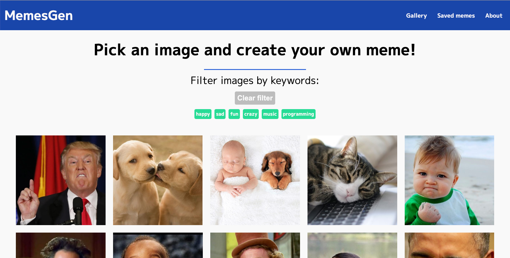
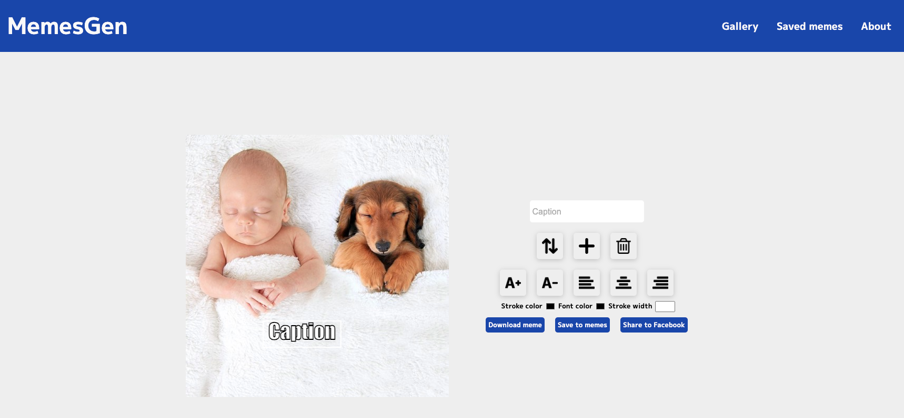

# Meme Generator

A Web App for creating memes - Feel free to download and test it offline !
Oh and, this time I also took some more time and decided to create a better README.

## About

This is a web application that allows users to create memes by adding text to images.
The application is built with web technologies such as HTML, CSS, and JavaScript.
It uses the [Canvas API](https://developer.mozilla.org/docs/Web/API/Canvas_API) to draw the meme text on the image. 
Processing the image and text is done client-side, so no data is sent to any server.

## Features

Some of the key features of the application include creating memes by:
- Selecting an image from the gallery
- Filtering the gallery
- An archive containing you saved memes
- Moving text around and controlling its placement & looks

## Screenshots

The following screenshots show the application in action:




## Give It A GO

Clone the repository to your local machine:

```sh
git clone git@github.com:levit0mer/memesGenerator.git
```

Navigate to the project's directory and open index.html in your browser

##  ! Enjoy !